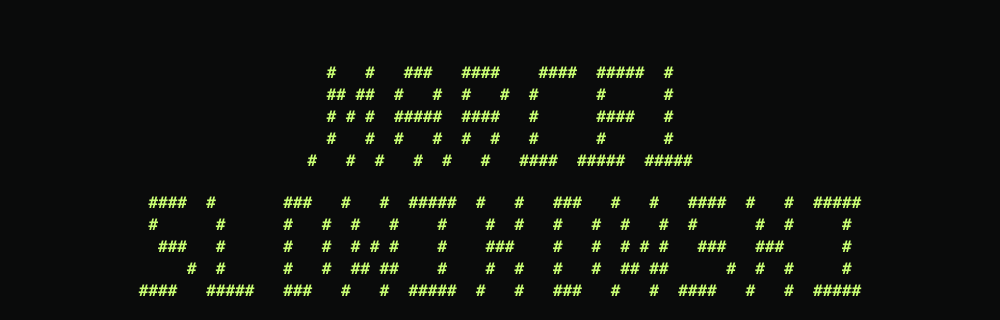

<div align="center">
  
</div>

<p align="center">
  <a href="https://www.orafrontier.com"></a>
  <a href="https://marceljs.com"></a>
  <a href="https://www.linkedin.com/in/marcel-slowikowski/"></a>
</p>

<p align="center">
  
</p>

## `whoami`

I am a founder and engineer working at the boundary of **AI research, low-level runtime systems, and polished software products**.

I started by building across web, mobile, and cloud. Today, I spend most of my time on a harder question: **how do we make capable AI models practical on the hardware people already own?**

```text
research idea
    └──> systems design
            └──> working runtime
                    └──> product people can actually use
```

## `current_process`

### [Ora Frontier](https://www.orafrontier.com) · Founder & CEO

Ora Frontier is building private AI software for personal and enterprise hardware. We compile, package, and run supported models through a consistent local execution layer, so prompts, files, and workflows can stay on the user's machine.

```text
MODEL CHECKPOINT
      │
      ▼
ARCHITECTURE ANALYSIS
      │
      ▼
ORA COMPILER  ── compression · normalization · hardware profiles
      │
      ▼
PORTABLE MODEL PACK
      │
      ▼
ORA RUNTIME   ── device-aware execution · local serving
      │
      ▼
PRIVATE LOCAL AI
```

**What I am focused on right now**

* Model compression beyond basic quantization
* Architecture-aware compilation and portable model packs
* GPU-specific runtime paths across consumer hardware generations
* Private, local inference without rebuilding dense weights at runtime
* Turning research-grade systems work into a product that feels simple

**Product surface**

* **Ora Core** for people running private AI on their own machines
* **Ora CLI** for developers integrating local models into their workflows
* **Ora Fleet** for teams managing private AI across multiple systems

## `experience.log`

| Chapter                                | What I did                                                                                                   |
| -------------------------------------- | ------------------------------------------------------------------------------------------------------------ |
| **Ora Frontier**                       | Founded the company and lead product, research direction, technical strategy, fundraising, and go-to-market. |
| **Mueze AI** *(previously PromptShop)* | Helped build AI infrastructure supporting more than **1,300 stores** and **500 agencies**.                   |
| **Independent engineering**            | Built software across AI, web, mobile, cloud infrastructure, developer tools, and interactive systems.       |
| **Iowa State University**              | Studying Computer Science while building companies and shipping production systems.                          |

<details>
<summary><b>A path that does not fit neatly into one title</b></summary>
<br />

Work I began early in my career created opportunities connected to **Blue Origin, Formula 1, Hollywood, and venture-backed AI**. The common thread was never the industry. It was building something difficult enough to get noticed.

</details>

## `stack --current`

### AI, systems, and runtime

<p>
  
</p>

`C` · `C++` · `Python` · `CUDA / GPU systems` · `Linux` · `Bash` · `Docker` · `Git`

### Product engineering

<p>
  
</p>

`TypeScript` · `JavaScript` · `React` · `Next.js` · `Node.js` · `Tailwind CSS` · `PostgreSQL` · `Figma`

### Broader experience

`Java` · `C# / .NET` · `Swift` · `Kotlin` · `Flutter` · `React Native` · `MongoDB` · `Firebase` · `GCP` · `Azure` · `Unity`

## `operating_principles`

```yaml
build:
  - start with the hard technical constraint
  - reduce complexity before adding abstraction
  - measure what happens on real hardware
  - make the final product feel simpler than the system underneath it

care_about:
  - local ownership
  - privacy by default
  - performance without inflated claims
  - ambitious engineering with practical outcomes
```

## `selected_interests`

* Local and private AI
* Model compression and efficient inference
* Compilers, runtimes, and GPU architecture
* Developer infrastructure
* Full-stack product systems
* Human-computer interaction
* Building companies around difficult technical problems

## `github_activity`

<picture>
  <source media="(prefers-color-scheme: dark)" srcset="https://raw.githubusercontent.com/marceljs041/marceljs041/output/github-contribution-grid-snake-dark.svg" />
  <source media="(prefers-color-scheme: light)" srcset="https://raw.githubusercontent.com/marceljs041/marceljs041/output/github-contribution-grid-snake.svg" />
  
</picture>

<div align="center">
  
  
</div>

## `connect`

The best conversations usually start with **AI systems, local inference, unusual technical problems, or ambitious products**.

<p>
  <a href="https://www.orafrontier.com">Ora Frontier</a> ·
  <a href="https://marceljs.com">Portfolio</a> ·
  <a href="https://www.linkedin.com/in/marcel-slowikowski/">LinkedIn</a>
</p>

<div align="center">
  <br />
  <strong>Democratizing AI, one late night at a time.</strong>
  <br /><br />
  <sub>Build the system. Prove it on real hardware. Make it usable.</sub>
</div>
